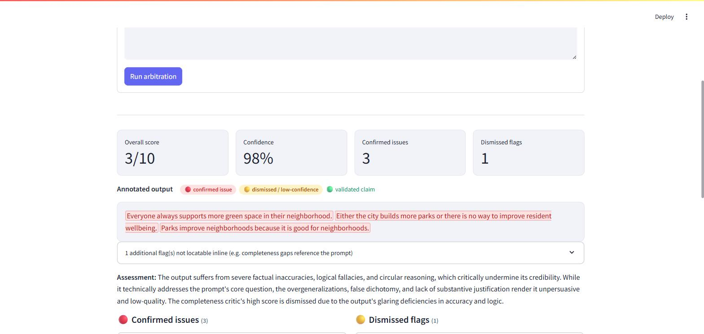
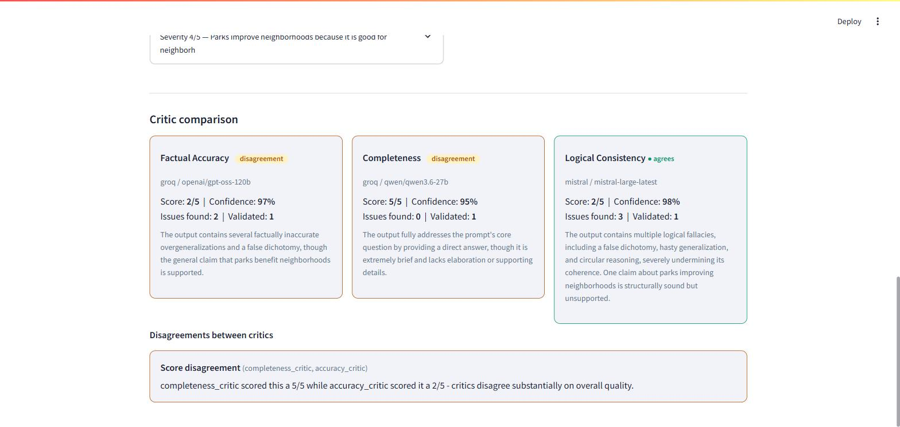
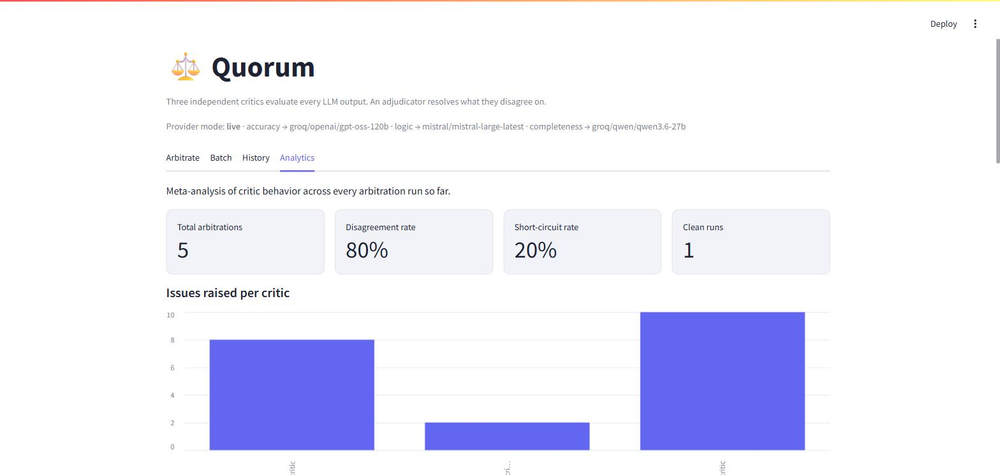

# Quorum

[](https://www.python.org/)
[](LICENSE)
[](https://github.com/langchain-ai/langgraph)
[](https://fastapi.tiangolo.com/)
[](https://streamlit.io/)

> A quorum is the minimum number of independent members needed before a decision counts. Here, three of them are AI models.

Quorum is a multi-agent evaluation pipeline that catches bad LLM outputs instead of generating more of them. Three independent critic agents — factual accuracy, logical consistency, completeness — evaluate any LLM-generated output in parallel, an adjudicator resolves what they disagree on, and the result is a single confidence-scored verdict with evidence-backed callouts, not a black-box score.

Most AI portfolio projects demonstrate generation. This one demonstrates evaluation — the skill AI teams are actively hiring for and rarely see in candidates.



## Table of contents

- [Features](#features)
- [Screenshots](#screenshots)
- [Architecture](#architecture)
- [Why three critics instead of one self-review pass](#why-three-critics-instead-of-one-self-review-pass)
- [Tech stack](#tech-stack)
- [Quickstart](#quickstart-no-api-keys-required)
- [Going live with real models](#going-live-with-real-models)
- [Docker](#docker)
- [API reference](#api-reference)
- [Verdict Explorer UI](#verdict-explorer-ui-streamlit)
- [Test cases](#test-cases)
- [Testing](#testing)
- [License](#license)

## Features

- **Three independently-modeled critics** (accuracy / logic / completeness), routed through different providers so their blind spots don't overlap
- **An adjudicator** that reasons through disagreements into one confidence-scored verdict — confirmed issues and explicitly dismissed flags, not a naive average
- **Parallel critic dispatch** via LangGraph, with automatic retries, graceful degradation on critic failure, and a short-circuit fast path for clean outputs
- **A deterministic offline mock mode** — the entire pipeline (dispatch, disagreement detection, adjudication, storage, API, UI) runs end to end with zero API keys
- **A Streamlit Verdict Explorer** with inline color-coded annotations, batch mode, full history, and cross-run analytics on critic behavior
- **A documented FastAPI service** backed by a full SQLite audit trail
- **A one-command Docker Compose setup**

## Architecture

```
                        ┌──────────────┐
                        │  parse_input │
                        └──────┬───────┘
                 ┌─────────────┼─────────────┐
                 ▼             ▼             ▼
         ┌───────────┐ ┌───────────┐ ┌────────────────┐
         │ accuracy  │ │  logic    │ │  completeness   │   <- run in parallel,
         │ critic    │ │  critic   │ │  critic         │      different model
         │ (Groq)    │ │ (Mistral) │ │ (Groq)          │      per critic
         └─────┬─────┘ └─────┬─────┘ └────────┬────────┘
                 └─────────────┼─────────────┘
                                ▼
                     ┌────────────────────┐
                     │ collect_critiques  │  (fan-in)
                     └─────────┬──────────┘
                                ▼
                     ┌────────────────────┐
                     │ detect_disagreements│
                     └─────────┬──────────┘
              ┌─────────────────┼─────────────────┐
              ▼                 ▼                 ▼
        all critics        no disagreements   otherwise
        failed                & all clean
              │                 │                 │
              ▼                 ▼                 ▼
     all_failed_verdict  short_circuit_verdict  adjudicate
              └─────────────────┼─────────────────┘
                                ▼
                     ┌────────────────────┐
                     │ synthesize_verdict │
                     └────────────────────┘
```

Critics are deliberately routed through **different model families** so their
blind spots don't overlap: accuracy → Groq (`openai/gpt-oss-120b`), logic →
Mistral (`mistral-large-latest`), completeness → Groq again but on a different
model (`qwen/qwen3.6-27b`). If all three used the same model, they'd share the
same blind spots — the disagreements between models are the most valuable
signal this system produces. Every provider/model is overridable via env vars
(see `.env.example`), including pointing any critic at NVIDIA NIM, OpenAI, or a
self-hosted Ollama model instead. (NVIDIA NIM was the original pick for the
completeness critic, matching a 3-provider design, but its free tier proved too
slow/queued in practice - observed 51s-180s+ per call, occasionally longer than
useful - so it was swapped for a second Groq model, which is fast and reliable.)

## Why three critics instead of one self-review pass

A single model reviewing its own output shares that output's blind spots. Three
independently-prompted, independently-modeled critics, each scoped to one
dimension (accuracy / logic / completeness), catch different failure modes and
disagree often enough that the disagreements themselves become a diagnostic
signal — tracked in the Analytics tab.

## Tech stack

| Layer                 | Tool                                             |
| ---------------------- | ------------------------------------------------- |
| Language               | Python 3.11+                                       |
| Agent orchestration    | [LangGraph](https://github.com/langchain-ai/langgraph) |
| LLM providers          | Groq, Mistral — NVIDIA NIM, OpenAI, Ollama also supported |
| Structured output      | Pydantic + [`instructor`](https://github.com/jxnl/instructor) |
| Storage                | SQLite                                             |
| API                    | FastAPI                                            |
| UI                     | Streamlit                                          |
| Testing                | pytest                                             |
| Containerization       | Docker Compose                                     |

## Quickstart (no API keys required)

The system ships with a deterministic **mock provider mode** — offline,
zero-cost stand-in critics that exercise the full pipeline (parallel dispatch,
disagreement detection, adjudication, storage, API, UI) so anyone can run it
end-to-end without paid API keys. This is the default (`ARBITRATION_PROVIDER_MODE=mock`).

```bash
python -m venv .venv
source .venv/Scripts/activate   # or .venv\Scripts\activate on Windows cmd
pip install -r requirements.txt

# Run the four portfolio test cases (factual errors / logical fallacies /
# misses-the-point / clean pass) end to end:
python scripts/run_test_cases.py

# Explore verdicts in the UI:
streamlit run ui/streamlit_app.py

# Or hit the API directly:
uvicorn api.main:app --reload
# docs at http://localhost:8000/docs
```

## Going live with real models

Set `ARBITRATION_PROVIDER_MODE=live` (see `.env.example`) and provide:

- `GROQ_API_KEY` — for the accuracy critic and the completeness critic ([console.groq.com](https://console.groq.com))
- `MISTRAL_API_KEY` — for the logic critic and the adjudicator ([console.mistral.ai](https://console.mistral.ai))

Groq, Mistral, NVIDIA NIM, and OpenAI all expose an OpenAI-compatible
`/chat/completions` endpoint (as does a self-hosted Ollama), so
`arbitration/providers.py` talks to any of them through one code path — only
the base URL, API key, and model name differ per provider, configurable per
critic via env vars. Structured output is enforced end-to-end via
[`instructor`](https://github.com/jxnl/instructor) in JSON mode, so every critic
and the adjudicator return validated Pydantic models — never raw text to parse.
A critic with a missing/invalid key, or a request that exceeds
`CRITIC_REQUEST_TIMEOUT_SECONDS` (default 30s), fails that one critic gracefully
(see graceful degradation, above) rather than crashing the run.

**A note on client construction and threading:** the first time a given
provider's client is built, constructing its underlying `httpx`/SSL context can
deadlock if done concurrently from multiple threads — which is exactly what
LangGraph's parallel critic dispatch does on the very first call. `providers.py`
guards this with a lock and a cache: only one thread ever constructs a given
provider's client, every other caller (concurrent or not) reuses it, and actual
concurrent *requests* against an already-built client are unaffected.

## Docker

```bash
docker compose up --build
# api -> http://localhost:8000/docs
# ui  -> http://localhost:8501
```

Defaults to mock mode so `docker compose up` works with no keys at all; put
`ARBITRATION_PROVIDER_MODE=live` plus `GROQ_API_KEY` / `MISTRAL_API_KEY` in a
`.env` file to go live. An optional local Ollama service is included behind a
compose profile if you'd rather self-host one critic:
`docker compose --profile local up` (then `docker compose exec ollama ollama pull <model>`
and point that critic's `*_PROVIDER=ollama`).

## API reference

| Method | Endpoint                     | Description                          |
| ------ | ----------------------------- | ------------------------------------- |
| `POST` | `/v1/arbitrate`               | Evaluate one output, returns a full `ArbitrationRecord` |
| `POST` | `/v1/arbitrate/batch`         | Evaluate multiple outputs, returns a list of records |
| `GET`  | `/v1/arbitrations/{id}`       | Retrieve a past verdict by id |
| `GET`  | `/v1/arbitrations`            | List recent arbitrations |
| `GET`  | `/v1/arbitrations/count`      | Total arbitrations recorded |
| `GET`  | `/v1/health`                  | Health check + current provider mode |

Full interactive OpenAPI docs are served at `/docs` once the API is running.
Every arbitration is persisted as a full JSON audit trail in SQLite
(`data/arbitration.db`).

## Verdict Explorer UI (Streamlit)

- **Arbitrate** — submit a single output/prompt pair, see the output with inline
  color-coded annotations (🔴 confirmed issue, 🟡 dismissed/low-confidence flag,
  🟢 explicitly validated claim) plus a side-by-side critic comparison panel.
- **Batch** — submit a CSV or pasted set of outputs, get a sortable results table.
- **History** — browse every past arbitration from the SQLite audit trail.
- **Analytics** — meta-analysis across every run: which critic finds the most
  issues, which critic gets overruled by the adjudicator most often, disagreement
  type breakdown, and critic failure rates.

## Screenshots

**Critic comparison** — accuracy and completeness disagree with each other while logic agrees with neither, each with its own score, confidence, and reasoning:



**Analytics** — meta-analysis across every arbitration run so far: disagreement rate, short-circuit rate, and issues raised per critic:



## Test cases

`scripts/run_test_cases.py` runs four canned cases end-to-end and writes results
to `data/test_case_results.{json,md}`:

1. **factually_incorrect** — three planted factual errors, caught by the accuracy critic.
2. **logically_flawed** — hasty generalization, false dichotomy, circular reasoning,
   and a non-sequitur, caught by the logic critic.
3. **misses_the_point** — technically answers half the question, caught by the
   completeness critic while accuracy/logic stay clean.
4. **genuinely_good** — a clean, accurate, well-reasoned, complete response —
   all three critics agree, adjudication is short-circuited, clean bill of health.

## Testing

```bash
pip install -r requirements-dev.txt
pytest
```

Covers structured-output validation, disagreement-detection rules (issue
presence / severity gap / unique finding / score gap), the LangGraph routing
(clean short-circuit, normal adjudication, partial critic failure with graceful
degradation, total critic failure), SQLite round-trips, and the FastAPI routes.

## License

Quorum is licensed under the [MIT License](LICENSE).
