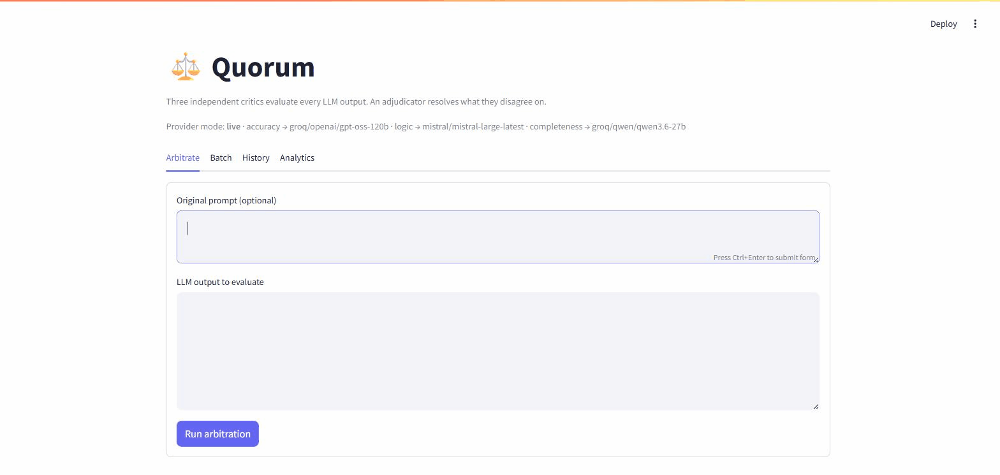
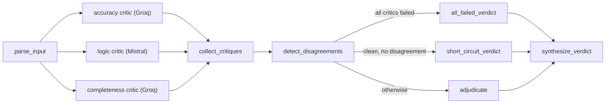

# Quorum

[](https://www.python.org/)
[](LICENSE)
[](https://github.com/langchain-ai/langgraph)
[](https://fastapi.tiangolo.com/)
[](https://streamlit.io/)

> A quorum is the minimum number of independent members needed before a decision counts. Here, three of them are AI models.

Quorum takes an LLM output and tries to find what's wrong with it. Three critic agents look it over at the same time: one checks the facts, one checks the reasoning, one checks whether the response actually answers what was asked. When they disagree about something, an adjudicator reads through the disagreement, decides who's right, and writes up a verdict with a confidence score and the specific evidence behind each flagged issue.



*A genuine run against real Groq and Mistral models, nothing mocked. Full-size screenshots further down.*

## Table of contents

- [Features](#features)
- [Screenshots](#screenshots)
- [Architecture](#architecture)
- [Why three critics instead of one self-review pass](#why-three-critics-instead-of-one-self-review-pass)
- [Tech stack](#tech-stack)
- [Quickstart](#quickstart-no-api-keys-required)
- [Going live with real models](#going-live-with-real-models)
- [Docker](#docker)
- [API reference](#api-reference)
- [Verdict Explorer UI](#verdict-explorer-ui-streamlit)
- [Test cases](#test-cases)
- [Testing](#testing)
- [License](#license)

## Features

- **Three independently modeled critics** covering accuracy, logic, and completeness, each routed through a different provider so their blind spots never line up
- **An adjudicator** that reads through every disagreement, decides what to confirm and what to dismiss, and writes up one verdict with a confidence score attached
- **Parallel critic dispatch** through LangGraph, with automatic retries, graceful degradation whenever a critic fails, and a short-circuit path that skips straight to a clean verdict when nothing is wrong
- **A deterministic offline mock mode**, where the entire pipeline (dispatch, disagreement detection, adjudication, storage, API, UI) runs from start to finish without a single API key
- **A Streamlit Verdict Explorer** featuring inline, color-coded annotations, a batch mode, a searchable history, and analytics tracking critic behavior across runs
- **A documented FastAPI service** with a full SQLite audit trail behind it
- **A one-command Docker Compose setup**

## Architecture



**[Open the interactive version →](https://claude.ai/code/artifact/b7113e91-ac3e-4b28-acb5-f37619d36e65)** Click any stage to see exactly what it does and which file it lives in.

Critics are deliberately routed through **different model families** so their blind spots never line up: accuracy runs on Groq (`openai/gpt-oss-120b`), logic runs on Mistral (`mistral-large-latest`), and completeness runs on Groq again, though on a separate model (`qwen/qwen3.6-27b`). Had all three shared a single model, they would have shared its blind spots too, and it turns out the disagreements between distinct models are the most valuable signal the whole system produces. Every provider and model can be swapped through environment variables (see `.env.example`), including pointing any critic at NVIDIA NIM, OpenAI, or a self-hosted Ollama instance instead. NVIDIA NIM was actually the original choice for the completeness critic, fitting a neat three-provider design, but its free tier turned out to be far too slow in practice: calls regularly took anywhere from 51 to 180 seconds, sometimes longer, so it got swapped out for a second Groq model that responds quickly and reliably.

## Why three critics instead of one self-review pass

A single model reviewing its own output tends to share that output's blind spots. Three independently prompted critics, each modeled separately and scoped to one dimension (accuracy, logic, completeness), catch different failure modes instead, and they disagree often enough that those disagreements become a diagnostic signal in their own right, one the Analytics tab tracks over time.

## Tech stack

| Layer                 | Tool                                             |
| ---------------------- | ------------------------------------------------- |
| Language               | Python 3.11+                                       |
| Agent orchestration    | [LangGraph](https://github.com/langchain-ai/langgraph) |
| LLM providers          | Groq and Mistral (NVIDIA NIM, OpenAI, and Ollama are also supported) |
| Structured output      | Pydantic + [`instructor`](https://github.com/jxnl/instructor) |
| Storage                | SQLite                                             |
| API                    | FastAPI                                            |
| UI                     | Streamlit                                          |
| Testing                | pytest                                             |
| Containerization       | Docker Compose                                     |

## Quickstart (no API keys required)

The system ships with a deterministic **mock provider mode**: offline, zero-cost stand-in critics that exercise the full pipeline (parallel dispatch, disagreement detection, adjudication, storage, API, UI), letting anyone run it end to end without paying for a single API call. This is the default (`ARBITRATION_PROVIDER_MODE=mock`).

```bash
python -m venv .venv
source .venv/Scripts/activate   # or .venv\Scripts\activate on Windows cmd
pip install -r requirements.txt

# Run the four portfolio test cases (factual errors / logical fallacies /
# misses-the-point / clean pass) end to end:
python scripts/run_test_cases.py

# Explore verdicts in the UI:
streamlit run ui/streamlit_app.py

# Or hit the API directly:
uvicorn api.main:app --reload
# docs at http://localhost:8000/docs
```

## Going live with real models

Set `ARBITRATION_PROVIDER_MODE=live` (see `.env.example`) and provide:

- `GROQ_API_KEY`, which powers the accuracy critic and the completeness critic ([console.groq.com](https://console.groq.com))
- `MISTRAL_API_KEY`, which powers the logic critic and the adjudicator ([console.mistral.ai](https://console.mistral.ai))

Groq, Mistral, NVIDIA NIM, and OpenAI all expose an OpenAI-compatible `/chat/completions` endpoint, and so does a self-hosted Ollama, which means `arbitration/providers.py` can talk to any of them through a single code path. Only the base URL, API key, and model name differ per provider, each one configurable per critic through environment variables. Structured output is enforced end to end using [`instructor`](https://github.com/jxnl/instructor) in JSON mode, so every critic and the adjudicator hand back validated Pydantic models instead of raw text that needs parsing. A critic with a missing or invalid key, or a request that runs past `CRITIC_REQUEST_TIMEOUT_SECONDS` (30 seconds by default), just fails on its own. It doesn't take the whole run down with it.

**A note on client construction and threading:** the first time a given provider's client gets built, constructing its underlying `httpx`/SSL context can deadlock if several threads attempt it at once, and that is exactly what LangGraph's parallel critic dispatch does on the very first call. `providers.py` guards against this with a lock and a cache. Only one thread ever constructs a given provider's client; every other caller, concurrent or not, simply reuses it, and actual concurrent *requests* made against an already-built client stay unaffected.

## Docker

```bash
docker compose up --build
# api -> http://localhost:8000/docs
# ui  -> http://localhost:8501
```

It defaults to mock mode, so `docker compose up` works with no keys at all. Add `ARBITRATION_PROVIDER_MODE=live` plus `GROQ_API_KEY` and `MISTRAL_API_KEY` to a `.env` file to go live. An optional local Ollama service sits behind a compose profile for anyone who would rather self-host one critic: run `docker compose --profile local up`, then `docker compose exec ollama ollama pull <model>`, and point that critic's `*_PROVIDER` at `ollama`.

## API reference

| Method | Endpoint                     | Description                          |
| ------ | ----------------------------- | ------------------------------------- |
| `POST` | `/v1/arbitrate`               | Evaluate one output, returns a full `ArbitrationRecord` |
| `POST` | `/v1/arbitrate/batch`         | Evaluate multiple outputs, returns a list of records |
| `GET`  | `/v1/arbitrations/{id}`       | Retrieve a past verdict by id |
| `GET`  | `/v1/arbitrations`            | List recent arbitrations |
| `GET`  | `/v1/arbitrations/count`      | Total arbitrations recorded |
| `GET`  | `/v1/health`                  | Health check + current provider mode |

Full interactive OpenAPI docs live at `/docs` once the API is running, and every arbitration gets persisted as a complete JSON audit trail in SQLite (`data/arbitration.db`).

## Verdict Explorer UI (Streamlit)

- **Arbitrate**: submit a single output/prompt pair and see the output rendered with inline, color-coded annotations (🔴 confirmed issue, 🟡 dismissed/low-confidence flag, 🟢 explicitly validated claim), alongside a side-by-side critic comparison panel.
- **Batch**: submit a CSV or a pasted set of outputs and get back a sortable results table.
- **History**: browse every past arbitration straight from the SQLite audit trail.
- **Analytics**: a meta-analysis across every run, covering which critic finds the most issues, which one gets overruled by the adjudicator most often, how disagreement types break down, and how often each critic fails outright.

## Screenshots

**Critic comparison**: accuracy and completeness disagree with each other while logic sides with neither, each carrying its own score, confidence, and reasoning.


**Analytics**: a meta-analysis across every arbitration run so far, covering disagreement rate, short-circuit rate, and issues raised per critic.


## Test cases

`scripts/run_test_cases.py` runs four canned cases end-to-end and writes results to `data/test_case_results.{json,md}`:

1. **factually_incorrect**: three planted factual errors, caught by the accuracy critic.
2. **logically_flawed**: hasty generalization, false dichotomy, circular reasoning, and a non-sequitur, all caught by the logic critic.
3. **misses_the_point**: technically answers half the question, caught by the completeness critic while accuracy and logic stay clean.
4. **genuinely_good**: a clean, accurate, well-reasoned, complete response. All three critics agree, adjudication short-circuits, and the result is a clean bill of health.

## Testing

```bash
pip install -r requirements-dev.txt
pytest
```

It covers structured-output validation, the four disagreement-detection rules (issue presence, severity gap, unique finding, score gap), every LangGraph routing path (clean short-circuit, normal adjudication, partial critic failure with graceful degradation, total critic failure), SQLite round-trips, and the FastAPI routes themselves.

## License

Quorum is licensed under the [MIT License](LICENSE).
